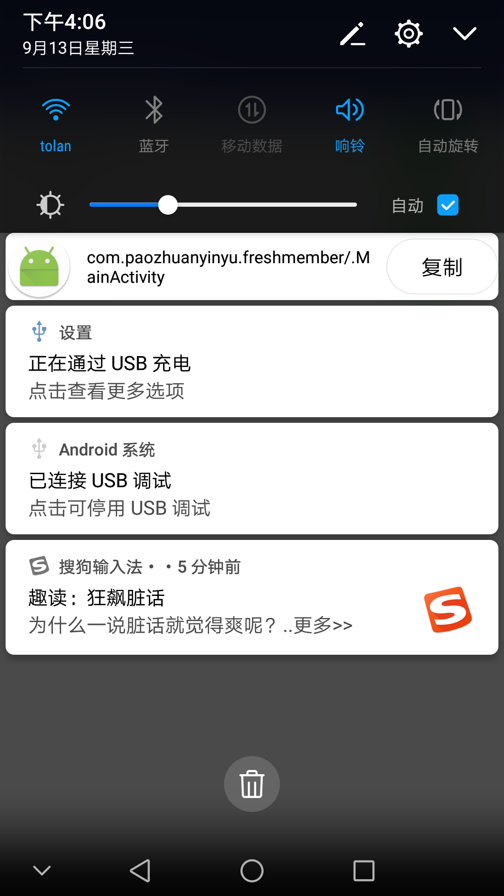

# FreshMember

## 简介
当你刚接手一个陌生项目的时候，对项目结构还不熟悉，在熟悉项目期间，肯定是经常对应这代码跑一下项目，但是一个项目里面可能有很多个Activity，但是你不熟悉，看起来很费劲。这个小工具就是来解决这个问题的，它可以将当前Activity的全限定类名显示在通知栏，你可以很方便的知道任何界面的类名。所以如果你研究其他app，这个工具也可以帮到你。

## 原理
这个工具的原理是AccessibilityService, 这个服务现在广泛用于非手机厂商应用商店自动安装应用，抢红包等场景，解决上面的问题更是不在话下。AccessibilityService可以监听AccessibilityEvent.TYPE_WINDOW_STATE_CHANGED事件，跳转界面是会触发这个事件的，然后你可以通过API获取当前界面的全限定类名；然后我将类名放在通知里显示在通知栏上，这个通知是常驻通知栏的；然后我用了一些进程常驻的办法，让这个服务的常驻后台，但是也不能保证100%常驻，一般情况下你把测试机设置一下后台运行，锁屏不清理，安全管家不清理等，然后你不手动杀死，基本上可以做到常驻。

## apk扫码下载

## Thanks

[ActivityLogHelper](https://github.com/yrickwong/ActivityLogHelper)
